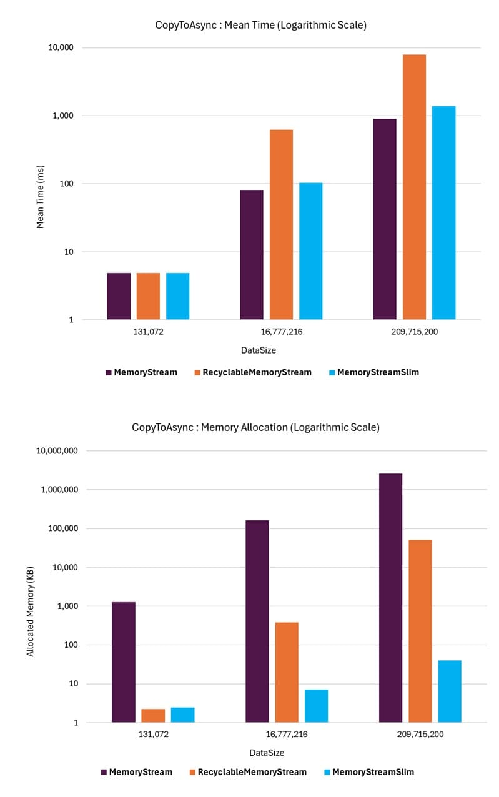

# CopyToAsync Throughput Benchmark

In-memory-based streams typically do not require asynchronous operations in most scenarios because all operations are synchronous and in-memory. However, there are cases where the data in the stream needs to be copied to another stream instance with actual asynchronous behavior, such as a **FileStream**. While this may not be a common use case, it is a real-world scenario. This is where the `CopyToAsync` method becomes relevant.

This benchmark scenario uses stream instances that are instantiated as expandable (dynamically growing) streams. The stream is filled with random data, similar to the [`Bulk Fill and Read`](./dynamic-throughput-benchmarks.md#bulk-fill-and-read) scenario.

In each operation, the **CopyToAsync** method copies data from the stream to another stream designed to emulate an actual file I/O-based stream with asynchronous behavior.

## Summary 

The benchmark results show that for smaller streams, all the stream classes perform similarly in terms of throughput performance. `MemoryStreamSlim` and **RecyclableMemoryStream** outperform **MemoryStream** in terms of memory allocation performance. However, as the stream size increases, the **MemoryStreamSlim** class maintains consistent and deterministic performance, even though the internal chained memory segments slightly slow down the process compared to **MemoryStream** when copying the entire stream contents to the destination stream.

The **MemoryStream** class performs the worst in terms of memory allocation performance under all conditions but achieves better throughput performance compared to **RecyclableMemoryStream** and **MemoryStreamSlim** for larger stream sizes.

As the stream size becomes substantial, the **RecyclableMemoryStream** class exhibits poor throughput performance, with performance rapidly deteriorating as the stream size increases further. Using the **UseExponentialLargeBuffer** option did not impact throughput performance in this scenario.

> _Given that file systems managed by the OS and related drivers employ a series of buffering and caching mechanisms, the [emulation](#asynchronous-stream-emulation) approach used in this benchmark is not a perfect representation of the actual performance of the **CopyToAsync** method in a real-world local file-based scenario. However, it provides a consistent and deterministic way to compare the performance of different stream classes for asynchronous I/O operations that incur regular asynchronous latencies, such as for network-based files on file servers._

## Example

The following graphs illustrate the performance of the **CopyToAsync** method for the different stream classes. The **MemoryStreamSlim** class achieves mean throughput comparable to the standard **MemoryStream** while significantly outperforming **RecyclableMemoryStream**.

For memory allocations, the **MemoryStreamSlim** class performs dramatically better than **RecyclableMemoryStream** and **MemoryStream**, with the performance gap becoming more pronounced as the stream size increases.

The differences in performance are so significant that the graphs are shown with a logarithmic scale to make the differences visible.

{class="benchmarkimgcentered"}

## Benchmark Operation

A single benchmark operation consists of performing five loops of the following steps:

1. Create a new stream instance; with a capacity set to the operation data size when the [CapacityOnCreate](#capacityoncreate) parameter is **true**.
1. Write the test data synchronously to the stream (either in a single write or segmented based on the [BulkInitialFill](#bulkinitialfill) parameter).
1. Call CopyToAsync() on the stream, passing a mock asynchronous file I/O stream destination.
1. Dispose of the stream instance.

**MemoryStreamSlim** and **RecyclableMemoryStream** classes are created with the option to zero out memory buffers when they are no longer used disabled to focus the benchmark performance on the **CopyToAsync()** call. The **MemoryStream** class does not have an option to zero out memory buffers (used memory is always cleared, i.e., internal buffers are allocated with new byte[]), so this parameter does not apply to that class.

### Asynchronous Stream Emulation

The destination stream used in the **CopyToAsync** call is a simple mock stream that emulates the behavior of an asynchronous I/O-based stream. This is achieved by using a **MemoryStream** instance internally to manage the stream contents. Each asynchronous operation on the mock stream class (**ReadAsync**, **WriteAsync**, **CopyToAsync**) is counted, and on every 8th operation (or after at least 10MB of data has been processed), an asynchronous delay is introduced to simulate the latency of an actual I/O operation. The delay time is calculated to emulate a data throughput of 2GB/sec with a 0.5 ms latency for every separate asynchronous operation.

While not a perfect real-world emulation, this approach provides a consistent and deterministic performance comparison between the different stream classes, specifically for benchmarking and highlighting the impact of the number of internal asynchronous operations performed. Results using different I/O-based streams will vary based on the actual I/O performance characteristics of the underlying system.

## Benchmark Parameters

The following parameters were used in the benchmarks. These appear as columns in the benchmark results along with the [standard BenchmarkDotNet columns](./memorystream-benchmarks.md#legend).

### DataSize

The amount of data to write to the stream in each operation loop. The data is a byte array of the specified size.

### CapacityOnCreate

- **true**: The stream is instantiated with the current loop iteration data size as the initial capacity.
- **false**: The stream is created with the default capacity (no initial capacity specified).

The results show no notable difference in performance between the two options, but this parameter is included in the benchmark to clarify that fact.

### BulkInitialFill

- **true**: The stream is initially filled with random data in a single bulk write operation.
- **false**: The stream is filled with random data in a loop of write operations.

The initial stream data fill operation is similar to the operations used in the [Bulk Fill and Read](./dynamic-throughput-benchmarks.md#bulk-fill-and-read) (**BulkInitialFill** is _true_) and [Segmented Fill and Read](./dynamic-throughput-benchmarks.md#segmented-fill-and-read) (**BulkInitialFill** is _false_) benchmarks. The results show no notable difference in performance between the two options, but this parameter is included in the benchmark to clarify that fact.

## Benchmark Results

The results of the benchmarks are available in the [`CopyToAsync()`](./MemoryStreamBenchmarks.CopyToAsyncThroughputBenchmarks-report-github.md) benchmark output.

### HTML Report

Since the benchmark results can create large tables, which may be difficult to navigate due to horizontal and vertical scrolling, the results are also provided in a simpler HTML table format.
The HTML report can be found [here](./MemoryStreamBenchmarks.CopyToAsyncThroughputBenchmarks-report.html).
