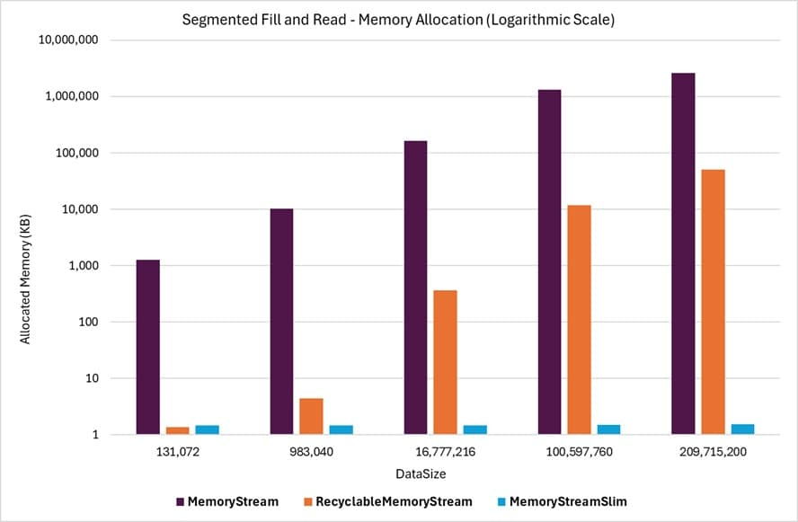

# Dynamic Growth Throughput Benchmarks

These benchmarks evaluate the performance of dynamic, expandable streams. The stream is filled with data in a loop, and the data is read back in a loop to examine the throughput performance of reading and writing, as well as the memory allocation and garbage collection impact of different stream classes.

## Summary 

The benchmark results show that `MemoryStreamSlim` consistently allocates less memory than other classes, with throughput performance on par with or better than **RecyclableMemoryStream**. In some use cases, **MemoryStreamSlim** performs dramatically better. While these cases may not always represent real-world scenarios, they demonstrate that **MemoryStreamSlim** provides more consistent and deterministic performance across a wide range of scenarios.

For security-sensitive applications, `MemoryStreamSlim` performs better in most cases when the option to zero out unused memory buffers is enabled ([`ZeroBuffers`](#zerobuffers) benchmark parameter). In these benchmarks, when zeroing out memory buffers is enabled, the **MemoryStreamSlim** option to clear memory buffers "on release" was used to provide a fair comparison to other classes. However, by default, a more efficient option to clear buffers out-of-band is used, which further improves throughput performance by avoiding the cost of clearing memory buffers at the time of release, instead performing this task in a background thread.

The results for segmented operations also show that **RecyclableMemoryStream** has a high memory allocation rate and incurs a large number of garbage collections when stream sizes grow large, especially when the initial capacity is not provided during instantiation ([`CapacityOnCreate`](#capacityoncreate) benchmark parameter is **false**).

The following sections describe the different types of benchmarks run, along with general information on how to interpret the results, the benchmark operations, parameters, and scenarios used.

## Example

The following graph shows the memory allocations for the [`Segmented Fill And Read`](#segmented-fill-and-read) benchmarks. The horizontal axis shows the [DataSize](#datasize) written to the stream, and the allocations are expressed in KB. For this example, the **CapacityOnCreate**, **ZeroBuffers**, and **GrowEachLoop** parameters are all set to **false**. The graph shows the values in a logarithmic scale for better visibility of the differences in memory allocations.

{class="benchmarkimgcentered"}

Even with a logarithmic scale, this graph highlights the efficiency of `MemoryStreamSlim` in handling memory allocations and reuse. It minimizes memory traffic and avoids unnecessary allocations, resulting in significantly lower memory usage on average. This efficiency is further reflected in the garbage collection (GC) values observed in the same benchmarks.

| Class | DataSize | Gen0 | Gen1 | Gen2 |
| --- | --: | --: | --: | --: |
| MemoryStream | 131,072 | 208.252 | 208.252 | 208.252
| RecyclableMemoryStream  | 131,072 | 0.0610 | 0 | 0
| MemoryStreamSlim  | 131,072 | 0.0610 | 0 | 0
| MemoryStream | 983,040 | 2496.0938 | 2496.0938 | 2496.0938
| RecyclableMemoryStream  | 983,040 | 0.1221 | 0 | 0
| MemoryStreamSlim  | 983,040 | 0 | 0 | 0
| MemoryStream | 16,777,216 | 7468.75 | 7468.75 | 7468.75
| RecyclableMemoryStream  | 16,777,216 | 19.5313 | 0 | 0
| MemoryStreamSlim  | 16,777,216 | 0 | 0 | 0
| MemoryStream | 100,597,760 | 24,666.6667 | 24,666.6667 | 24,666.6667
| RecyclableMemoryStream  | 100,597,760 | 636.3636 | 0 | 0
| MemoryStreamSlim  | 100,597,760 | 0 | 0 | 0
| MemoryStream | 209,715,200 | 8000.00 | 8000.00 | 8000.00
| RecyclableMemoryStream  | 209,715,200 | 2600.00 | 200.00 | 0
| MemoryStreamSlim  | 209,715,200 | 0 | 0 | 0

## Benchmark Scenarios

The following scenarios were used for the benchmarks:

### Bulk Fill and Read

In this scenario, the write and read operations are performed in bulk. The entire data size is written in a single operation and read back in a single operation. The results of the benchmarks are available in the [`Bulk Fill And Read`](./MemoryStreamBenchmarks.BulkFillAndReadThroughputBenchmarks-report-github.md) benchmark output.

### Segmented Fill and Read

In this scenario, the write step is performed by writing a successive series of 4-kilobyte segments until [`DataSize`](#datasize) bytes have been written to the stream. The same approach is used to read the data back in 4KB segments. The results of the benchmarks are available in the [`Segmented Fill And Read`](./MemoryStreamBenchmarks.SegmentedFillAndReadThroughputBenchmarks-report-github.md) benchmark output.

## Benchmark Operation

A single benchmark operation consists of performing five loops of the following steps:

1. Create a new stream instance.
1. Write test data to the stream.
1. Read data back from the stream.
1. Dispose of the stream instance.

## Benchmark Parameters

The following parameters were used in the benchmarks. These parameters appear as columns in the benchmark results alongside the [standard BenchmarkDotNet columns](./memorystream-benchmarks.md#legend).

### DataSize

The amount of data written to the stream in each loop of the operation. The data is a byte array of the specified size. When the [GrowEachLoop](#groweachloop) parameter is set to true, the data size increases by a ratio of this value for each loop iteration. Otherwise, the data size remains fixed for all loop iterations.

### CapacityOnCreate

- When **true**, the stream is instantiated with the current loop iteration's data size as the initial stream capacity.
- When **false**, the stream is created with the default capacity (no initial capacity specified).

### ZeroBuffers

- When **true**, the stream is created with the option to zero out memory buffers when they are no longer used.
- When **false**, the stream is created with the option to not zero out memory buffers.

When **ZeroBuffers** is **true**, for the **MemoryStreamSlim** class, the [`ZeroBufferBehavior`](xref:KZDev.PerfUtils.MemoryStreamSlimOptions.ZeroBufferBehavior) option is set to `OnRelease` to provide a fair comparison to other classes. The **MemoryStream** class does not support zeroing out memory buffers (used memory is always cleared), so this parameter does not apply to that class.

### GrowEachLoop

- When **true**, the data size increases for each loop iteration within a benchmark operation. The amount of growth for each loop is a fixed ratio of the initial [DataSize](#datasize) parameter value.
- When **false**, the data size remains fixed for all loop iterations.

## HTML Reports

Since the benchmark results can create large tables that are difficult to navigate due to horizontal and vertical scrolling, the results are also provided in separate HTML tables for each scenario.

- [Bulk Fill and Read](./MemoryStreamBenchmarks.BulkFillAndReadThroughputBenchmarks-report.html)
- [Segmented Fill and Read](./MemoryStreamBenchmarks.SegmentedFillAndReadThroughputBenchmarks-report.html)
