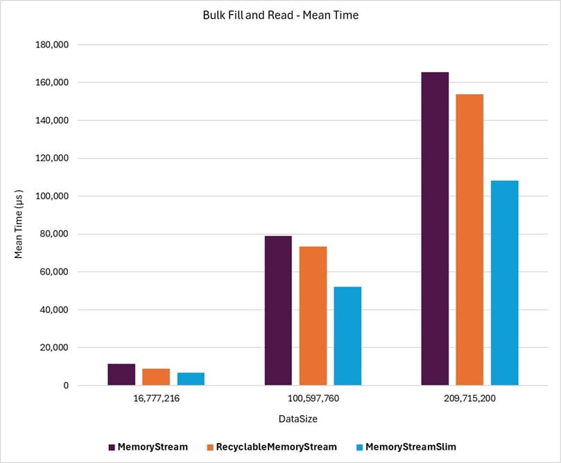

# MemoryStream Benchmarks

As previously mentioned, the general goals and approach to easing GC pressure and reducing memory traffic are the same for both `MemoryStreamSlim` and **RecyclableMemoryStream**. For benchmarking purposes, the standard **MemoryStream** class, **RecyclableMemoryStream**, and **MemoryStreamSlim** are compared side-by-side for performance across various use cases.

In all cases, the benchmark values for the **MemoryStream** class are used as the baseline for comparison. The **RecyclableMemoryStream** and **MemoryStreamSlim** classes are then compared to the **MemoryStream** class to determine the performance and memory allocation differences for each set of benchmark parameters.

## Example

The following graph shows a portion of the results from the [`Bulk Fill And Read`](./dynamic-throughput-benchmarks.md#bulk-fill-and-read) benchmarks, showing that `MemoryStreamSlim` achieves mean time throughput superior to the standard **MemoryStream** while significantly outperforming **RecyclableMemoryStream**. More details can be found in the various benchmark discussion pages.

{class="benchmarkimgcentered"}

## Benchmark Scenarios

The benchmark scenarios are categorized into five groups:

- **Dynamic Throughput** 

  Benchmarks using dynamically expandable streams instantiated with an initial zero length and capacity. [Read More](./dynamic-throughput-benchmarks.md)

- **CopyToAsync Throughput**

  Benchmarks demonstrating the performance impact of copying the contents of a stream to another stream asynchronously. [Read More](./copytoasync-throughput-benchmarks.md)

- **Wrapper Throughput**

  Benchmarks for streams instantiated with an already allocated and available byte array to evaluate "wrapped" mode behavior. [Read More](./wrapper-throughput-benchmarks.md)

- **Continuous Growth Throughput**

  Benchmarks demonstrating the performance impact of accessing the internal buffer directly and continuing to grow the stream afterward. [Read More](./continuous-growth-throughput-benchmarks.md)

## Reading Results

### Parameter Effect

Not every parameter used in the benchmarks applies to every class being compared. For example, the MemoryStream class does not have an option to zero out memory buffers, as this is its default and only behavior.

Two considerations apply in such cases:

1. The **MemoryStream** class operations are run for every parameter scenario, even when the **ZeroBuffers** parameter is not applicable, to make the results easy to read and compare side by side with other classes.
1. Benchmark results where **ZeroBuffers** is set to **true** provide a more accurate comparison between the different classes. However, results where **ZeroBuffers** is set to **false** highlight the performance gains achievable by not zeroing out memory buffers for non-sensitive data streams.

Specific parameter values with similar caveats are noted in the descriptions of the respective benchmark scenarios.

### Loop Count Impact

To keep benchmark operation times reasonable and measurable, many benchmark operations are run with a small loop of repeated steps. This ensures the benchmark operation times are neither too short to be unreliable nor excessively long.

### Legend

The following are the standard BenchmarkDotNet columns found in the benchmark results. Each benchmark scenario describes the parameter value meanings for its specific benchmark runs.

| Column | Description |
| --- | --- |
| Mean | Arithmetic mean of all measurements
| Error | Half of 99.9% confidence interval
| StdDev | Standard deviation of all measurements
| Median | Value separating the higher half of all measurements (50th percentile)
| Ratio | Mean of the ratio distribution ([Current]/[Baseline])
| RatioSD | Standard deviation of the ratio distribution ([Current]/[Baseline])
| Gen0 | GC Generation 0 collects per 1000 operations
| Gen1 | GC Generation 1 collects per 1000 operations
| Gen2 | GC Generation 2 collects per 1000 operations
| Allocated | Allocated memory per single operation (managed only, inclusive, 1KB = 1024B)
| Alloc Ratio | Allocated memory ratio distribution ([Current]/[Baseline])
| 1 μs | 1 Microsecond (0.000001 sec)
| 1 ms | 1 Millisecond (0.001 sec)

### HTML Reports

Since the benchmark results can create large tables that may be difficult to navigate due to horizontal and vertical scrolling, the results are also provided in separate HTML files for each scenario.

## Versions

The benchmarks published here used the following versions of the libraries:

- `BenchmarkDotNet` version: 0.14.0
- `KZDev.PerfUtils` version: 2.0.0
- `RecyclableMemoryStream` version: 3.0.1
- `MemoryStream` version: .NET 9.0.4