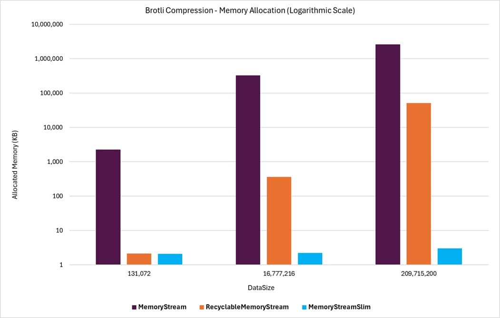

# MemoryStream Compression Benchmarks

This benchmark evaluates the performance of different **MemoryStreamSlim** types as the destination stream for compression operations.

There is a separate benchmark scenario for each type of compression technology:

- Brotli Compression
- Deflate Compression
- GZip Compression
- ZLib Compression

## Summary 

The benchmark results highlight the superior performance and efficiency of `MemoryStreamSlim` compared to both **RecyclableMemoryStream** and the standard **MemoryStream** class. While **RecyclableMemoryStream** and **MemoryStreamSlim** perform comparably in terms of throughput, **MemoryStreamSlim** consistently demonstrates significantly lower memory allocations, making it the more memory-efficient choice.

In scenarios where the destination stream is created without an initial capacity, **MemoryStreamSlim** maintains its efficiency, whereas **RecyclableMemoryStream** incurs higher memory allocations. The standard **MemoryStream** class, serving as the baseline, lags behind both alternatives in throughput and memory efficiency.

### Example

This example graph shows the memory allocations for different data sizes using the benchmarked memory stream classes with Brotli compression. The destination memory streams are created without an initially specified capacity value. Even with the graph using a logarithmic scale, the dramatic efficiency in memory usage of **MemoryStreamSlim** compared to the other classes is clearly visible.

{class="benchmarkimgcentered"}

## Benchmark Scenarios

The compression benchmarks are run with source byte arrays of various sizes. The compression classes are compared to the **MemoryStream** class as the baseline for comparison. The **RecyclableMemoryStream** and **MemoryStreamSlim** classes are then compared to the **MemoryStream** class to determine the performance and memory allocation differences for each set of benchmark parameters.

The benchmark being run uses the different MemoryStream types as the destination stream for the compression operations.

### Benchmark Operation

A single benchmark operation consists of performing five loops of the following steps:

1. Create a new stream instance to receive the result of the compression operation.
1. Create an instance of the compression class to perform the compression.
1. Send the test data through the compression class to the memory stream instance receiving the compressed result.
1. Dispose of the compression class instance.
1. Dispose of the destination memory stream instance.

For the benchmarks:

- **MemoryStreamSlim** and **RecyclableMemoryStream** are created with the option to zero out memory buffers disabled to focus the performance comparison on the compression operation.
- The **MemoryStream** class does not support zeroing out memory buffers (its internal buffers are always allocated with new byte[]), so this option does not apply.

### Benchmark Parameters

The following parameters were used in the benchmarks.

#### DataSize

The size of the source data that is compressed into the destination stream in each operation loop. The source data is a byte array of the specified size.

#### CapacityOnCreate

- When **true**, the destination stream is instantiated with the data size as the initial capacity.
- When **false**, the stream is created with the default capacity (no initial capacity specified).

The results show no notable difference in throughput performance whether this parameter is **true** or **false**. However, there is a noticeable impact on memory allocations for **MemoryStream** and a significant impact for **RecyclableMemoryStream** when this is **false**. 

The issue with this parameter is that the capacity set on the stream for the benchmark is a best guess based on the data size (source data size is used), and the actual size of the compressed data is not known until after the compression operation is complete. This means that the used capacity may be too small or too large, however the guess capacity used in these benchmarks did result in generally better allocation results in this case. 

## Benchmark Results

The results of the benchmarks are available in the following reports:

- [Brotli Compression](./MemoryStreamBenchmarks.BrotliCompressionThroughputBenchmarks-report-github.md)
- [Deflate Compression](./MemoryStreamBenchmarks.DeflateCompressionThroughputBenchmarks-report-github.md)
- [GZip Compression](./MemoryStreamBenchmarks.GZipCompressionThroughputBenchmarks-report-github.md)
- [ZLib Compression](./MemoryStreamBenchmarks.ZLibCompressionThroughputBenchmarks-report-github.md)

### Legend

These are the standard BenchmarkDotNet columns found in the benchmark results. Each benchmark scenario will describe the parameter value meanings for those specific benchmark runs on those topic pages.

| Column | Description |
| --- | --- |
| DataSize | The size of the source data that is compressed into the destination stream
| CapacityOnCreate | Indicates if a capacity was set on the destination stream when it was created
| Mean | Arithmetic mean of all measurements
| Error | Half of 99.9% confidence interval
| StdDev | Standard deviation of all measurements
| Ratio | Mean of the ratio distribution ([Current]/[Baseline])
| RatioSD | Standard deviation of the ratio distribution ([Current]/[Baseline])
| Gen0 | GC Generation 0 collects per 1000 operations
| Gen1 | GC Generation 1 collects per 1000 operations
| Gen2 | GC Generation 2 collects per 1000 operations
| Allocated | Allocated memory per single operation (managed only, inclusive, 1KB = 1024B)
| Alloc Ratio | Allocated memory ratio distribution ([Current]/[Baseline])
| 1 μs | 1 Microsecond (0.000001 sec)
| 1 ms | 1 Millisecond (0.001 sec)

### HTML Tables

Since the benchmark results can create rather large tables, and the benchmark output tables can be difficult to absorb with the horizontal and vertical table scrolling, the results are also provided in separate static HTML tables for each compression class. 

- [Brotli Compression](./MemoryStreamBenchmarks.BrotliCompressionThroughputBenchmarks-report.html)
- [Deflate Compression](./MemoryStreamBenchmarks.DeflateCompressionThroughputBenchmarks-report.html)
- [GZip Compression](./MemoryStreamBenchmarks.GZipCompressionThroughputBenchmarks-report.html)
- [ZLib Compression](./MemoryStreamBenchmarks.ZLibCompressionThroughputBenchmarks-report.html)

## Versions

The benchmarks published here used the following versions of the libraries:

- `BenchmarkDotNet` version: 0.14.0
- `KZDev.PerfUtils` version: 2.0.0
- `RecyclableMemoryStream` version: 3.0.1
- `MemoryStream` and Compression Streams version: .NET 9.0.4
