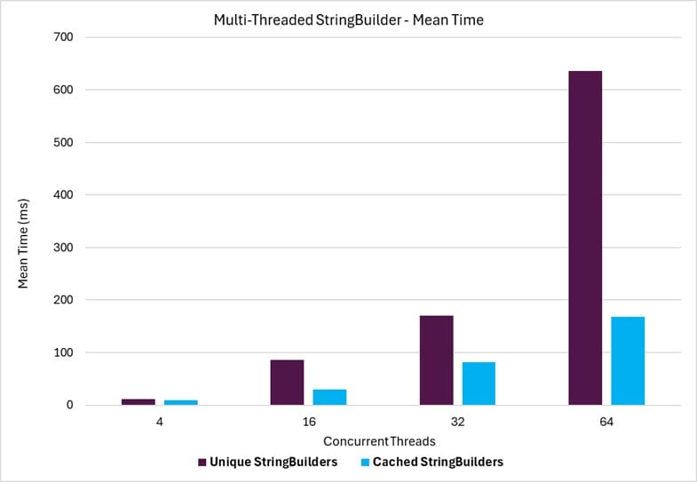

# StringBuilderCache Benchmarks

The benchmark tests for the `StringBuilderCache` compare the throughput time and memory consumption differences between using the **StringBuilderCache** and the standard **StringBuilder** class (where a new instance is instantiated for each use). There are two benchmark scenarios:

1. A single-threaded scenario where a single thread repeatedly use StringBuilder class instances.
1. A multi-threaded scenario where multiple threads use StringBuilder instances simultaneously.

The results for these scenarios are presented in the following sections.

## Summary

The benchmark results demonstrate that `StringBuilderCache` significantly improves performance and reduces memory allocations compared to the standard **StringBuilder** class alone, particularly in scenarios with repeated or concurrent usage. In the single-threaded scenario, **StringBuilderCache** achieves faster throughput by reusing cached instances, minimizing the overhead of creating new **StringBuilder** objects. 

In the multi-threaded scenario, the benefits of **StringBuilderCache** are even more pronounced, as it effectively handles concurrent operations while maintaining lower memory consumption and allocation rates. These results highlight the efficiency of **StringBuilderCache** in both single-threaded and multi-threaded environments, making it a valuable optimization for applications that require frequent string manipulations.

## Example

The following graph shows the throughput time for the [Multi-Threaded](./stringbuildercache-multithread-throughput-benchmarks.md) benchmarks. The horizontal axis shows the number of concurrently running benchmark threads. The time is shown in milliseconds.

{class="benchmarkimgcentered"}

## Benchmark Scenarios

The benchmark scenarios are divided into two categories: **Single Thread** and **Multiple Threads**.

### Single Thread

The Single Thread benchmark scenario uses a single thread to repeatedly build a string from a series of string segments using the StringBuilder class, and then retrieve the built string. [Read More](./stringbuildercache-throughput-benchmarks.md)

### Multiple Threads

The Multiple Threads benchmark scenario uses the same operation flow as the Single Thread scenario, but multiple threads run the operations simultaneously. [Read More](./stringbuildercache-multithread-throughput-benchmarks.md)

## Reading Results

### Allocations

Building a string in memory inherently requires memory allocations, so the allocation values in the benchmarks are substantial. While the absolute allocation values may not provide much insight, the key takeaway is the comparison and difference in allocations between the **StringBuilder** and **StringBuilderCache** use cases. The Alloc Ratio column is particularly useful for this comparison.

The string segments used to build the strings are pre-allocated (outside the scope of the benchmarks) and are identical for each benchmark operation. The allocations measured are solely the result of the operations performed by the **StringBuilder** or **StringBuilderCache** classes.

### Legend

These are the standard BenchmarkDotNet columns found in the benchmark results. For these benchmarks, the baseline is the 'Unique StringBuilders' scenarios, where a unique **StringBuilder** instance is created for each operation.

| Column      | Description                                                                  |
| ----------- | ---------------------------------------------------------------------------- |
| Mean        | Arithmetic mean of all measurements                                          |
| Error       | Half of 99.9% confidence interval                                            |
| StdDev      | Standard deviation of all measurements                                       |
| Median      | Value separating the higher half of all measurements (50th percentile)       |
| Ratio       | Mean of the ratio distribution ([Current]/[Baseline])                        |
| RatioSD     | Standard deviation of the ratio distribution ([Current]/[Baseline])          |
| Gen0        | GC Generation 0 collects per 1000 operations                                 |
| Gen1        | GC Generation 1 collects per 1000 operations                                 |
| Gen2        | GC Generation 2 collects per 1000 operations                                 |
| Allocated   | Allocated memory per single operation (managed only, inclusive, 1KB = 1024B) |
| Alloc Ratio | Allocated memory ratio distribution ([Current]/[Baseline])                   |
| 1 μs        | 1 Microsecond (0.000001 sec)                                                 |
| 1 ms        | 1 Millisecond (0.001 sec)                                                    |

### HTML Tables

Since the benchmark results can create rather large tables, and the benchmark output tables can be difficult to absorb with the horizontal and vertical table scrolling, the results are also provided in separate static HTML tables for each scenario. 

- [Single Threaded](./StringsBenchmarks.StringBuilderThroughputBenchmarks-report.html)
- [Multi-Threaded](./StringsBenchmarks.StringBuilderThroughputBenchmarks-report.html)

## Versions

The benchmarks published here used the following versions of the libraries:

- `BenchmarkDotNet` version: 0.14.0
- `KZDev.PerfUtils` version: 2.0.0
- `StringBuilder` version: .NET 9.0.4