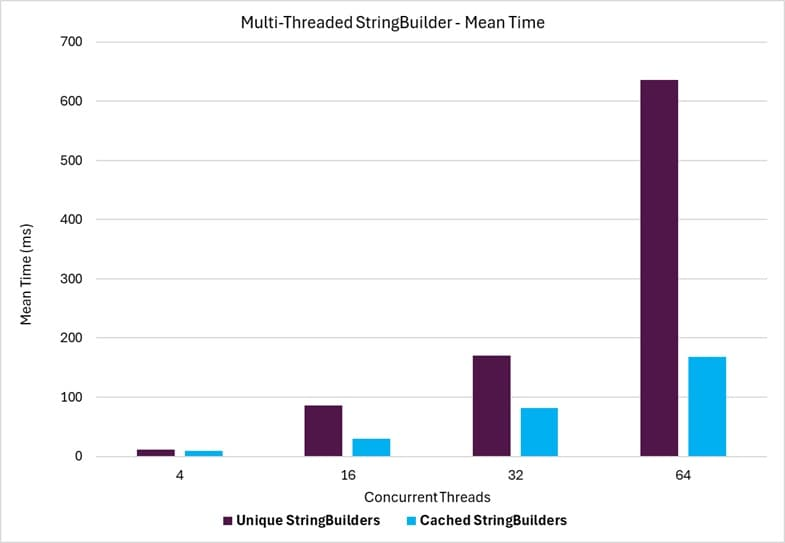
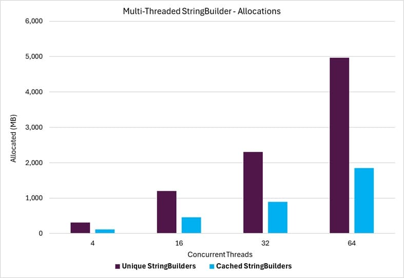

# Multi-Threaded StringBuilder Throughput Benchmarks

This benchmark compares the throughput performance of **StringBuilder** class instances managed with the `StringBuilderCache` class (_'Multi-Thread Cached StringBuilders'_) against operations that instantiate a new StringBuilder class for each use (_'Multi-Thread Unique StringBuilders'_). The operations are run on multiple threads, with each thread using a single instance of the **StringBuilder** at a time.

## Summary 

The benchmark results demonstrate that utilizing the `StringBuilderCache` class consistently outperforms using unique instances of the **StringBuilder** class in all scenarios. The throughput performance and memory allocation overhead of the **StringBuilderCache** class are significantly better than instantiating a new **StringBuilder** instance for each use. By reusing instances of the **StringBuilder** class, the **StringBuilderCache** eliminates the overhead of creating and disposing of instances and their internal buffers, improving both performance and memory efficiency.

### Benchmark Operations

A single benchmark operation consists of running multiple threads simultaneously, where each thread performs a loop 10,000 times with the following steps:

1. Acquire an instance of the **StringBuilder** class.
1. Append pre-allocated test string segments to the **StringBuilder** instance.
1. Retrieve the built string from the **StringBuilder** instance.
1. Release the **StringBuilder** instance back to the cache.[^1]

[^1]: This step applies only to the StringBuilderCache case. For the unique StringBuilder case, the StringBuilder instance is simply garbage collected.

### Benchmark Parameters

The following parameter was used in the benchmarks. Along with the [standard BenchmarkDotNet columns](./stringbuildercache-benchmarks.md#legend), it appears as a column in the benchmark results.

#### ThreadCount

This parameter indicates the number of threads used in the benchmark operations. Each thread simultaneously runs the same operation loop. A **benchmark operation** is complete when all threads have finished their operation loops.

## Examples

### Throughput Time

The following graph shows the throughput time when comparing unique **StringBuilder** instances to **StringBuilderCache**. The horizontal axis represents the number of concurrently running benchmark threads, and the vertical axis shows the time in milliseconds.

{class="benchmarkimgcentered"}

### Allocations

The following graph shows the memory allocations incurred when comparing unique **StringBuilder** instances to **StringBuilderCache**. The horizontal axis represents the number of concurrently running benchmark threads, and the vertical axis shows the memory allocations in MB.

{class="benchmarkimgcentered"}

## HTML Report

Since the benchmark results can create large tables that are difficult to navigate due to horizontal and vertical scrolling, the results are also provided in a simplified HTML table format.

The HTML report can be found [here](./StringsBenchmarks.StringBuilderThroughputBenchmarks-report.html).
