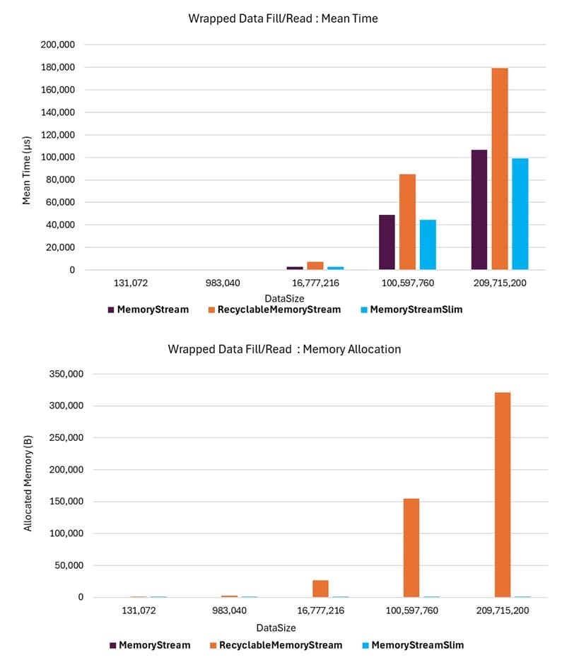

# Wrapped Throughput Benchmark

This benchmark scenario evaluates stream instances instantiated by providing an existing byte array, enabling Stream-semantic API access to the array.

Note that the **RecyclableMemoryStream** behaves differently: it does not use the provided byte array directly but instead creates a new byte array and copies the data into it. This appears to be due to the provided array not being from the internally managed and utilized pool of memory buffers.

The `MemoryStreamSlim` class internally wraps an instance of MemoryStream, which in turn wraps the provided byte array. This approach ensures consistent Stream-semantic API behavior while allowing the **MemoryStream** class to be used uniformly. It also provides deterministic behavior in this fixed mode of operation.

## Summary

The benchmark results indicate that **RecyclableMemoryStream** offers no performance advantage over **MemoryStream** when instantiated with a fixed byte array. In fact, it negatively impacts performance due to the overhead of copying the provided buffer into a new one. This copying operation becomes a significant performance bottleneck, especially for large data sizes.

The **MemoryStreamSlim** class exhibits the same throughput performance as **MemoryStream** since it is essentially a wrapper around a **MemoryStream** for this use case. Allocation differences arise because each loop iteration creates a new **MemoryStreamSlim** instance, which internally creates a new **MemoryStream** instance to wrap the provided byte array. Consequently, allocations are limited to the **MemoryStreamSlim** and **MemoryStream** instances, with no additional allocations.

## Example

The following graphs illustrate the performance of memory-based stream instances instantiated with a fixed byte array. These graphs demonstrate that **MemoryStreamSlim** achieves mean time throughput and memory allocations comparable to the standard **MemoryStream**, as expected given its approach to providing Stream semantics for a fixed-size byte array. In contrast, the **RecyclableMemoryStream** class negatively impacts performance due to its internal data copying mechanism, which introduces significant overhead.

{class="benchmarkimgcentered"}

## Benchmark Scenario

For this scenario, the stream is created with an initial source byte array. The write step overwrites the entire contents of the stream from the beginning done by writing a successive series of 4 kilobyte segments until [`DataSize`](#datasize) bytes have been written to the stream. The same approach is then used to read the data back in 4K segments.
The results of the benchmarks are found in the [`Wrapped Fill And Read`](./MemoryStreamBenchmarks.WrapperFillAndReadThroughputBenchmarks-report-github.md) benchmark output.

### Benchmark Operation

A single benchmark operation consists of performing five loops of the following steps:

1. Create a new stream instance.
1. Write test data to the stream.
1. Read data back from the stream.
1. Dispose of the stream instance.

### Benchmark Parameters

The following parameter was used in the benchmarks. This appears as a column in the benchmark results alongside the [standard BenchmarkDotNet columns](./memorystream-benchmarks.md#legend).

#### DataSize

The amount of data written to the stream in each loop iteration. This data is a byte array of the specified size, fixed for all iterations.

## HTML Report

Benchmark results are also provided in a simpler HTML table format to improve readability, especially for large tables. The HTML report can be found [here](./MemoryStreamBenchmarks.WrapperFillAndReadThroughputBenchmarks-report.html).
